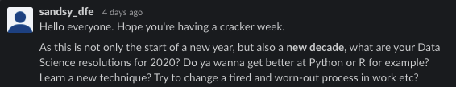
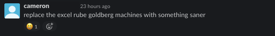
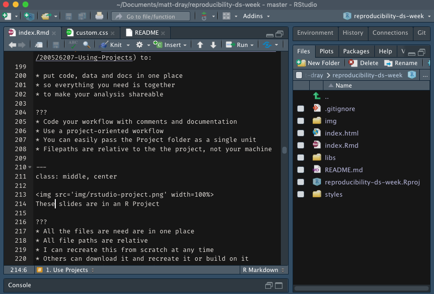
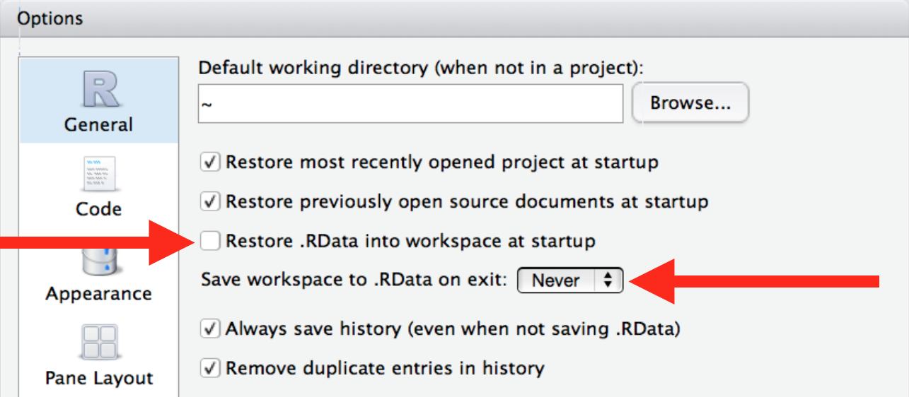
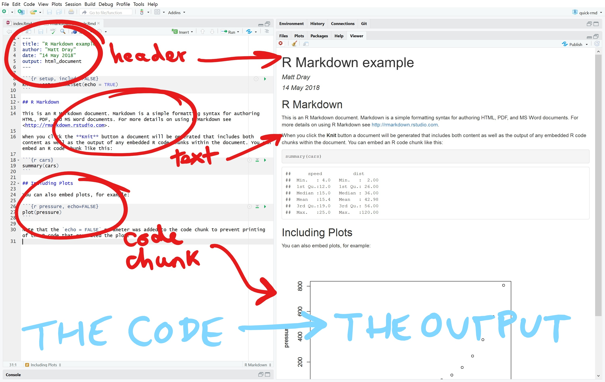
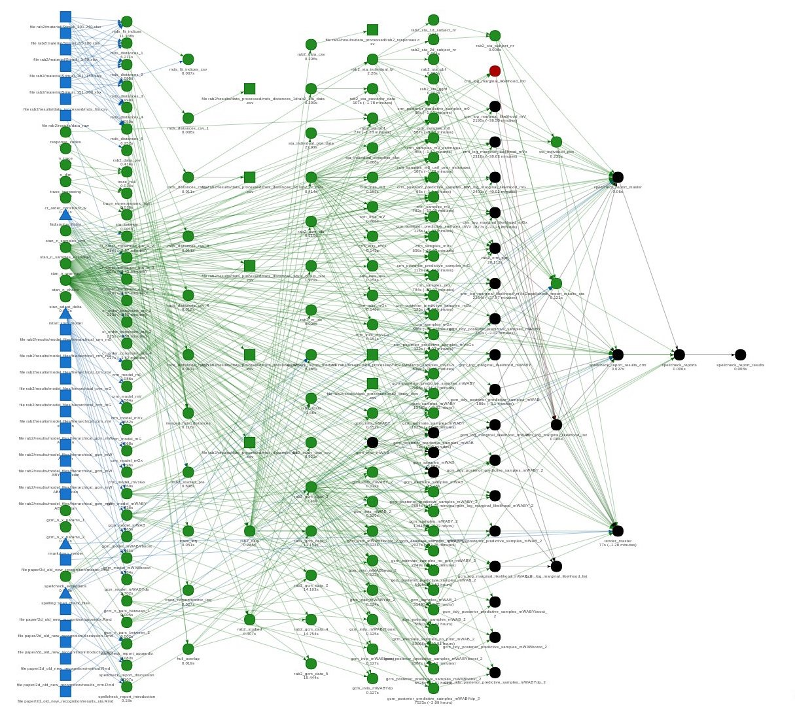
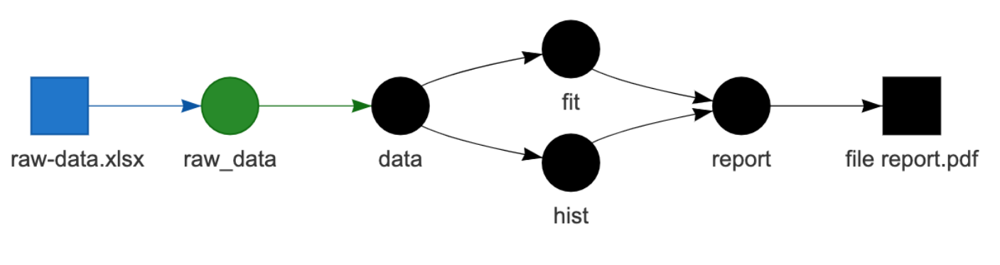

class: center, middle, inverse

# `r emo::ji("arrows_counterclockwise")` Reproducibility in R: three things

DfE Data Science Week, 2020-01-22

`r icon::fa('twitter')` [mattdray](https://twitter.com/mattdray)
`r icon::fa('github')` [matt-dray](https://github.com/matt-dray)
`r icon::fa('globe')` [rostrum.blog](https://www.rostrum.blog/)

???
* What reproducibility is, why you need it, some practical things you can do
* Focus is on R, but transferable
* You might be doing a bunch of this stuff already
* But hopefully you'll hear about something new

---
class: middle

tl;dr `r emo::ji("sleeping")`

* make your work reproducible
* unless you hate everyone
* especially yourself

???
* Reproducibility benefits anyone who wants to use your code or recreate work that's been done
* If you don't care about anyone else: it will still benefit you, specifically

---
class: inverse, middle, center

# 'Reproducible'

---
class: middle, center


From [The Turing Way](https://the-turing-way.netlify.com/introduction/introduction) by The Alan Turing Institute

???
* I think we care about reproducing outputs we've aready created (to prove that we can relaibly recreate the outcome) and updating with fresh data (like the next quarter's data)

---
class: middle

Can I recreate what you did:

* from scratch?
--
* on a different machine?
--
* in the future?
--
* without you present?

???
* We should know all the preparatory steps
* Maybe I don't have the same packages, maybe I'm using another OS
* Dependency changes break things
* What if you leave the department?

---
class: center, middle


You want to avoid saying this

---
class: middle

Reproducibility can help:

* reduce errors
--
* improve trust
--
* help you share
--
* speed up work

???
* You know it can be re-run to give the same results
* Others can see the steps taken and can recreate it themselves
* Everything you need in one folder/repo; all instructions in the box
* You're not building over old work and obfuscating and complicating things

---
class: middle, center


[Reproducible Analytical Pipelines](https://ukgovdatascience.github.io/rap-website/) (RAP)

???
* There's a grassroots movement to enact all this stuff in government already
* #rap-collaboration on govdatascience.slack.com
* DfE are already active: speak to CP or LS

---
class: middle, inverse

# Three things

---
class: middle

1. Centralise everything
1. Report with code
1. Manage workflows

???
* These are very broad -- what do they mean?
* Let's go through one by one
* I'll be focusing on R, but I think the points are transferable and Python analogues are available

---
class: inverse, middle

# 0\. Code everything

Haha, suckers, I zero-indexed my list!

???
* Before you do anything, switch to code from point-and-click
* I'll be picking on Excel a little bit
* Excel isn't _always_ bad
* It's just easier to be reproducible with code

---
class: middle, center





???
* We want to move away from workflows where we have lots of workbooks with multiple sheets
* Move away from pointing and clicking
* Move away from forgetting to drag formulae across the right cells
* Move toward coded analysis to provide a recipe for the workflow
* Move toward better documentation

---
class: middle, center


Scene from an Excel-based workflow

???
* Question everything; baulk at phrases like 'this is how we did it last year'
* Excel workflows might start simple, but can get clogged up very easily
* They don't encourage documentation
* They're 'data up front, code in the background', but we want the opposite

---
class: middle

Some resources:

* [Spreadsheet horror stories](http://www.eusprig.org/horror-stories.htm) by EuSpRiG
* [Excel vs R: a brief intro](https://www.jessesadler.com/post/excel-vs-r/) by Jesse Sadler
* [Arguments on switching from Excel to R](https://community.rstudio.com/t/pre-teaching-r-whats-your-best-argument-for-switching-to-r-from-excel/3182) from the RStudio Community

???
* EuSpRiG: European Spreadsheet Risks Interest Group

---
class: inverse, middle

# 1. Centralise everything

???
* Centralise your code, data, documentation, etc
* Put the code and any other needed files in one place
* Consider generalising and sharing functions

---
class: middle

`r emo::ji("card_index_dividers")` Use [R Projects](https://support.rstudio.com/hc/en-us/articles/200526207-Using-Projects) to:

* put code, data and docs in one place
* so everything you need is together
* to make your analysis shareable

???
* Code your workflow with comments and documentation
* Use a project-oriented workflow
* You can easily pass the Project folder as a single unit
* Filepaths are relative to the the project, not your machine

---
class: middle, center



These slides are in an R Project

???
* All the files are need are in one place
* All file paths are relative
* I can recreate this from scratch at any time
* Others can download it and recreate it or build on it
* From RStudio: File > New project
* Doesn't have to be RStudio; just need to have everything you need in one place

---
class: middle

`r emo::ji("package")` Write packages to:

* avoid repeating yourself
* generalise and centralise your functions
* share your work

Get started with:
* the [{usethis} workflow](https://www.hvitfeldt.me/blog/usethis-workflow-for-package-development/) by Emil Hvitfeldt
* the [R Packages book](http://r-pkgs.had.co.nz/) by Hadley Wickham

???
* Write, test and debug your frequently-used functions just once
* The whole organisation and beyond can use the same functions
* Put this under version control so you can always refer to older versions of your package

---
class: middle

Two quick RStudio tips:

* Don't save and restore the Project workspace



* Do restart all the time (Cmd/Ctrl+Shift+F10)

???
* Always be running your Project as though you're running it from scratch
* Each time you startup, start afresh
* Always be restarting RStudio to clear all objects
* That'll prevent you relying on objects that exist in your workspace that you may have made on the fly

---
class: inverse, middle

# 2. Report with code

---
class: middle

`r emo::ji("arrow_down")` Use [R Markdown](https://rmarkdown.rstudio.com/) to:

* put code in your reports
* update outputs instantly when code changes
* complete the reproducible data-to-output workflow

???
* From code chunks or inline
* New data? No problem. Re-run the code and the correct outputs are generated.

---
class: middle, center



???

---
class: middle

```{r echo=FALSE}
yr <- 2020
```
Declare a variable

```{r eval=FALSE}
yr <- format(Sys.Date(), "%Y")
```

Use it in R Markdown

```{r eval=FALSE}
> The year is `r yr`.
```

Render

> The year is 2020.

---
class: middle

Use R Markdown for lots of output types:

* [{xaringan}](https://slides.yihui.org/xaringan/#1) for slides
* [{bookdown}](https://bookdown.org/) for books
* [{blogdown}](https://bookdown.org/yihui/blogdown/) for blogs
* [{flexdashboard}](https://rmarkdown.rstudio.com/flexdashboard/index.html) for dashboards
* [{pagedown}](https://pagedown.rbind.io/) for paged HTML documents

Check out the [R Markdown book](https://bookdown.org/yihui/rmarkdown/) 

---
class: inverse, middle

# 3. Manage workflows

---
class: middle

{drake} `r emo::ji("brain")`

* makes your analysis pipeline reproducible
* remembers your workflow
* re-runs only what needs to be re-run

Learn more:

* on the [website](https://docs.ropensci.org/drake/)
* in the [user manual](https://books.ropensci.org/drake/)
* from this [recorded rOpenSci call](https://ropensci.org/commcalls/2019-09-24/)

???
* You can't remember all the parts of your large analysis and how they fit together
* Do you have to re-run everything from scratch if you change something about the analysis?
* {drake} is a brain that remembers all the relationships and the order in which things need to be run
* It only re-runs what needs to be re-run, saving you time and brainpower

---
class: middle

.pull-left[]

A complicated workflow by [Frederik Aust](https://twitter.com/FrederikAust/status/1205103780938833921?s=20)

Each point is an object, function or data set

Can you remember all of this?

???
* Here's a complicated workflow with lots of inputs
* Many objects (circles) and functions (triangles)
* If something changes, {drake} re-runs only what needs updating
* Saves computation and time

---
class: middle

{drake} example adapted from [Kirill Müller](https://krlmlr.github.io/drake-pitch/#1)

```{r eval=FALSE}
library(drake)
library(tidyverse)

# Create your own functions
create_plot <- function(data) {
  ggplot(data, aes(x = Petal.Width, fill = Species)) +
    geom_histogram()
}

# Create a workflow 'plan'
plan <- drake_plan( #<<
  raw_data = readxl::read_xlsx(file_in("raw-data.xlsx")),
  data = raw_data %>% mutate(Species = forcats::fct_inorder(Species)),
  hist = create_plot(data),
  fit = lm(Sepal.Width ~ Petal.Width + Species, data),
  report = rmarkdown::render(
    knitr_in("report.Rmd"),
    output_file = file_out("report.pdf"),
    quiet = TRUE
  )
)
```

???
* this is a very simplified example of how you set up a {drake} workflow
* Load packages, create your functions if required
* Wrap workflow steps in `drake_plan()`

---
class: middle

The plan is a dataframe of targets and commands

```{r eval=FALSE}
plan
## # A tibble: 5 x 2
##   target   command                                               
##   <chr>    <expr>                                                
## 1 raw_data readxl::read_xlsx(file_in("raw-data.xlsx"))          …
## 2 data     raw_data %>% mutate(Species = forcats::fct_inorder(Sp…
## 3 hist     create_plot(data)                                    …
## 4 fit      lm(Sepal.Width ~ Petal.Width + Species, data)        …
## 5 report   rmarkdown::render(knitr_in("report.Rmd"), output_file…
```

Make the plan to generate the targets

```{r eval=FALSE}
make(plan)
## target raw_data
## target data
## target fit
## target hist
## target report
```

---
class: middle

Update the data target and {drake} will:

* re-run out-of-date downstream targets (black)
* leave everything upstream alone



---
class: inverse, middle

# It doesn't end here

???
* It's impossible to cover everything adequately here
* There's some great free materials out there

---
class: middle

Also consider:

* [{renv}](https://rstudio.github.io/renv/articles/renv.html) for [dependency management](https://ukgovdatascience.github.io/rap-website/article-dependency-and-reproducibility.html)
* [{here}](https://here.r-lib.org/) for [relative file paths](https://github.com/jennybc/here_here)
* [Git and GitHub](https://speakerdeck.com/alicebartlett/git-for-humans) for version control
* [Docker](https://ropenscilabs.github.io/r-docker-tutorial/) to fully contain files/code/environment

???
* Dependency managers make sure breaking changes to packages don't affect you
* users/matt/project/data/ doesn't exist on your machine; you need relative paths like project/data/
* Version control lets you roll back changes and experiment safely
* Docker takes the idea of a project folder and makes it even better; it contains the package versions and operating environment (i.e. R version) you need to create everything from scratch

---
class: middle

Some things to read:

* [Putting the R into reproducible research](https://annakrystalli.me/talks/r-in-repro-research-dc.html#1) by Anna Krystalli
* [The Turing Way](https://the-turing-way.netlify.com/introduction/introduction.html) by The Alan Turing Institute
* [R for Reproducible Scientific Analysis](https://swcarpentry.github.io/r-novice-gapminder/) from Software Carpentry

---
class: middle

I've written about reproducibility:

* [Build an R package with {usethis}](https://www.rostrum.blog/2019/11/01/usethis/)
* [Git going: Git and GitHub](https://www.rostrum.blog/2019/10/21/git-github/)
* [Can {drake} RAP?](https://www.rostrum.blog/2019/07/23/can-drake-rap/)
* [A GitHub repo template for R analysis](A GitHub repo template for R analysis)
* [Knitting Club: R Markdown for beginners](Knitting Club: R Markdown for beginners)

---
class: inverse, middle

# Reproducibility in R: three things

1. Centralise everything
2. Report with code
3. Manage workflows

`r icon::fa('twitter')` [mattdray](https://twitter.com/mattdray)
`r icon::fa('github')` [matt-dray](https://github.com/matt-dray)
`r icon::fa('globe')` [rostrum.blog](https://www.rostrum.blog/)