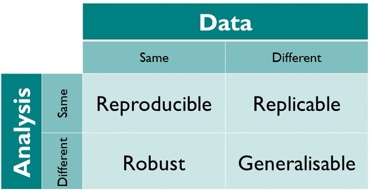
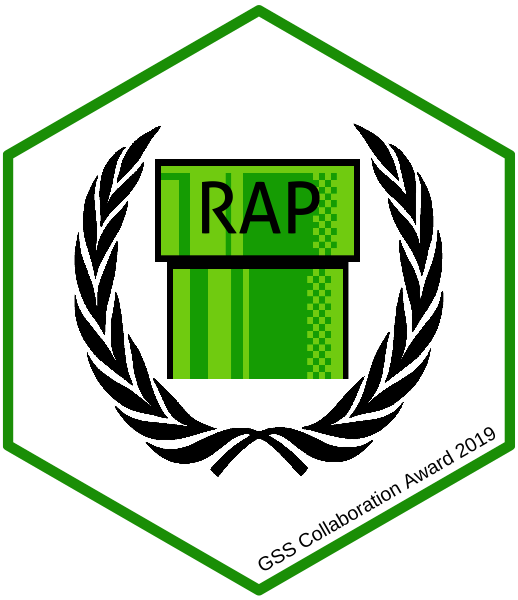

class: center, middle, inverse

# You Won't Believe These Three Crazy Tips To Improve Reproducibility!

`r icon::fa('twitter')` mattdray
`r icon::fa('github')` matt-dray
`r icon::fa('globe')` rostrum.blog 

DfE Data Science Week, 2020-01-22

---
class: center, middle

>Matt Dray from Cabinet Office will wow you with a small, medium and large thing you could (should!) do right now to make your work more reproducible. Why? Improving reproducibility can help you automate your work, speed things up, reduce errors and improve trust. The talk will focus on R, but the ideas are transferable.

---
class: middle

tl;dr

--

* make everything reproducible

--

* unless you hate everyone

--

* especially yourself

---
class: inverse, middle, center

'Reproducible'

---
class: middle

* Can I do it on a different machine?

* In the distant future?

* Do I know what I'm doing if I'm not you?

---
class: middle, center

From [The Turing Way](https://the-turing-way.netlify.com/introduction/introduction) by The Alan Turing Institute

???
* I think we care about reproducing outputs we've aready created (to prove that we can relaibly recreate the outcome) and updating with fresh data (like the next quarter's data)

---
class: middle, center

[Reproducible Analytical Pipelines](https://ukgovdatascience.github.io/rap-website/) (RAP)

???
* There's a grassroots movement to enact all this stuff in government already
* #rap-collaboration on govdatascience.slack.com
* DfE are already active: speak to your RAP Champion

---
class: middle

Three things:

--

1. Code everything

--

2. Including your reports

--

3. And your workflow

---
class: inverse, middle

1. Code everything

---
class: middle

Projects and packages

???
* Reconsider disparate, distributed files and data
* Reconsider Excel
* Put everything related to a project in one place (e.g. an RStudio Project)
* Or formalise parts of it for reuse (e.g. in a package) 
* Both approaches encourage documentation so colleagues and future you understand what's happening
* Put thes things under version control (as per David's talk on Git and GitHub)!

---
class: inverse, middle

1. Code everything

2. Including your reports

---
class: middle

R Markdown

???
* Insert outputs from code alongside text
* From code chunks or inline
* New data? No problem. Re-run the code and the correct outputs are generated.

---
background-image: url(img/r4ds-diamond-sizes-report.png)
background-size: contain

---
class: inverse, middle

3\. And your workflow

---
class: middle

{drake}

???
* You can't remember all the parts of your large analysis and how they fit together
* Do you have to re-run everything from scratch if you change something about the analysis?
* {drake} is a brain that remembers all the relationships and the order in which things need to be run
* It only re-runs what needs to be re-run, saving you time and brainpower

---
class: middle

Further reading

* [RAP website](https://ukgovdatascience.github.io/rap-website/) by you (?)
* [The Turing Way](https://the-turing-way.netlify.com/introduction/introduction) by The Alan Turing Institute
* [R Projects](https://support.rstudio.com/hc/en-us/articles/200526207-Using-Projects) by RStudio
* [Ode to {here}](https://github.com/jennybc/here_here) by Jenny Bryan
* [R packages](https://r-mageddon.netlify.com/post/writing-an-r-package-from-scratch/) by Tomas Westlake
* [R Markdown book](https://bookdown.org/yihui/rmarkdown/) by Yihui Xie, JJ Allaire & Garrett Grolemund
* {drake} [website]() and [book]() by Will Landau